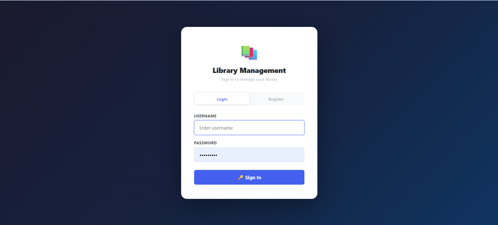
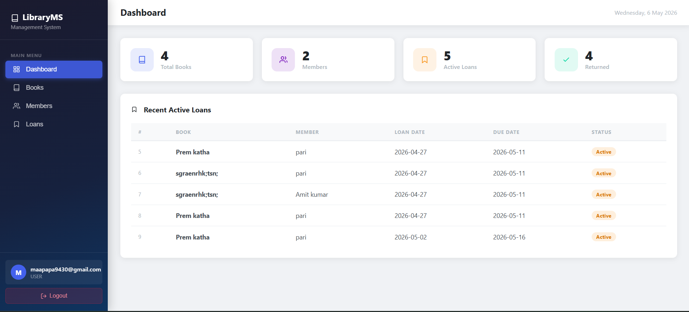
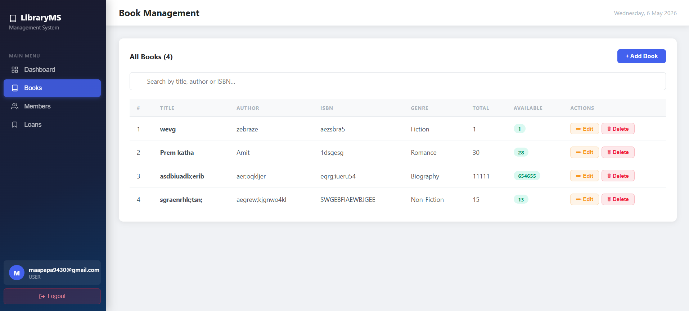
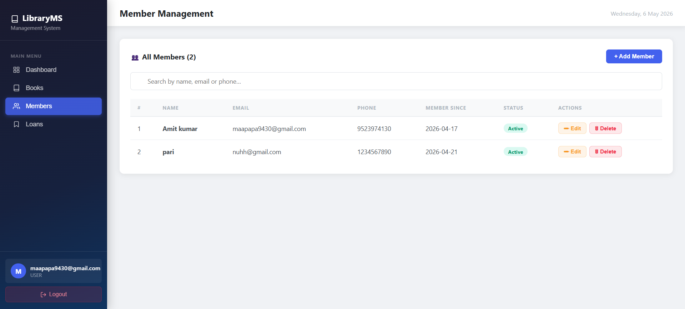
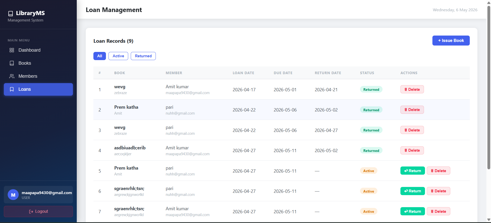

# 📚 LibraryMS — Library Management System

A full-stack web application for managing books, members, and loans with JWT-based authentication.

**Live Demo:** [library-management-frontend-amit.netlify.app](https://library-management-frontend-amit.netlify.app/login)

**Tech Stack:** Spring Boot · React (Vite) · MySQL · JWT

---

## ✨ Features

- **Dashboard** — real-time stats for total books, members, active loans, and returned books
- **Book Management** — add, edit, delete, and search books by title, author, or ISBN
- **Member Management** — manage library members with contact details and active/inactive status
- **Loan Management** — issue books, track due dates, mark returns, and filter by status
- **JWT Authentication** — secure login/register with token-based session management
- **Auto-redirect** — expired or invalid tokens automatically redirect to login

---

## 📸 Screenshots

### 🔐 Login & Register


### 📊 Dashboard


### 📖 Book Management


### 👥 Member Management


### 🔖 Loan Management


---

## 📁 Project Structure

```
library-management/
├── backend/                        ← Spring Boot project
│   ├── pom.xml
│   └── src/main/
│       ├── java/com/library/
│       │   ├── LibraryApplication.java
│       │   ├── config/             SecurityConfig.java
│       │   ├── controller/         Auth, Book, Member, Loan, Dashboard
│       │   ├── dto/                AuthRequest.java, AuthResponse.java
│       │   ├── filter/             JwtFilter.java
│       │   ├── model/              User, Book, Member, Loan
│       │   ├── repository/         UserRepo, BookRepo, MemberRepo, LoanRepo
│       │   └── util/               JwtUtil.java
│       └── resources/
│           └── application.properties
│
├── frontend/                       ← React + Vite project
│   ├── package.json
│   ├── vite.config.js
│   ├── index.html
│   └── src/
│       ├── main.jsx
│       ├── App.jsx
│       ├── index.css
│       ├── api/                    axios.js
│       ├── context/                AuthContext.jsx
│       ├── components/             Layout.jsx
│       └── pages/                  Login, Dashboard, Books, Members, Loans
│
└── database/
    └── setup.sql                   ← MySQL setup + seed data
```

---

## 🛠️ Requirements

| Tool    | Version |
|---------|---------|
| Java    | 17+     |
| Maven   | 3.8+    |
| Node.js | 18+     |
| MySQL   | 8.0+    |

---

## ⚙️ Setup & Installation

### Step 1 — MySQL Setup

Open MySQL Workbench or any MySQL client and run:

```sql
CREATE DATABASE library_db;
```

Optionally, run `database/setup.sql` to seed sample books and members.

---

### Step 2 — Configure the Backend

Open `backend/src/main/resources/application.properties` and update the following:

```properties
spring.datasource.url=jdbc:mysql://localhost:3306/library_db?useSSL=false&serverTimezone=UTC&allowPublicKeyRetrieval=true
spring.datasource.username=root           # your MySQL username
spring.datasource.password=your_password  # your MySQL password
```

---

### Step 3 — Run the Backend

```bash
cd backend
mvn spring-boot:run
```

Backend starts at: **http://localhost:8080**

> Spring Boot will auto-create all tables on first run (`ddl-auto=update`).

---

### Step 4 — Run the Frontend

```bash
cd frontend
npm install
npm run dev
```

Frontend starts at: **http://localhost:5173**

---

### Step 5 — Create Your First User

Open the app at http://localhost:5173, click **Register**, and create your account.

Or via curl:

```bash
curl -X POST http://localhost:8080/api/auth/register \
  -H "Content-Type: application/json" \
  -d '{"username":"admin","password":"admin123"}'
```

---

## 🌐 API Reference

### Authentication

| Method | Endpoint            | Description     | Auth |
|--------|---------------------|-----------------|------|
| POST   | /api/auth/register  | Register user   | No   |
| POST   | /api/auth/login     | Login → JWT     | No   |

### Books

| Method | Endpoint          | Description    | Auth |
|--------|-------------------|----------------|------|
| GET    | /api/books        | Get all books  | Yes  |
| GET    | /api/books/{id}   | Get one book   | Yes  |
| GET    | /api/books/search | Search books   | Yes  |
| POST   | /api/books        | Add book       | Yes  |
| PUT    | /api/books/{id}   | Update book    | Yes  |
| DELETE | /api/books/{id}   | Delete book    | Yes  |

### Members

| Method | Endpoint            | Description     | Auth |
|--------|---------------------|-----------------|------|
| GET    | /api/members        | Get all members | Yes  |
| GET    | /api/members/{id}   | Get one member  | Yes  |
| POST   | /api/members        | Add member      | Yes  |
| PUT    | /api/members/{id}   | Update member   | Yes  |
| DELETE | /api/members/{id}   | Delete member   | Yes  |

### Loans

| Method | Endpoint                  | Description       | Auth |
|--------|---------------------------|-------------------|------|
| GET    | /api/loans                | Get all loans     | Yes  |
| GET    | /api/loans/active         | Active loans only | Yes  |
| POST   | /api/loans                | Issue a book      | Yes  |
| PUT    | /api/loans/{id}/return    | Return a book     | Yes  |
| DELETE | /api/loans/{id}           | Delete record     | Yes  |

### Dashboard

| Method | Endpoint               | Description      | Auth |
|--------|------------------------|------------------|------|
| GET    | /api/dashboard/stats   | Stats & counts   | Yes  |

---

## 🔒 How JWT Authentication Works

1. User POSTs credentials to `/api/auth/login`
2. Server validates and returns a signed JWT token
3. React stores the token in `localStorage`
4. Every API call sends: `Authorization: Bearer <token>`
5. `JwtFilter` intercepts and validates each request
6. Expired or invalid token → 401 → automatic redirect to login

---

## ❓ Troubleshooting

**MySQL connection error**
- Verify username/password in `application.properties`
- Ensure MySQL service is running
- Check the URL includes `?allowPublicKeyRetrieval=true`

**Port already in use**
- Backend: change `server.port` in `application.properties`
- Frontend: change `port` in `vite.config.js`

**CORS error**
- The backend allows `localhost:5173` and `localhost:3000` by default
- For a different port, add it in `SecurityConfig.java` → `corsConfigurationSource()`
